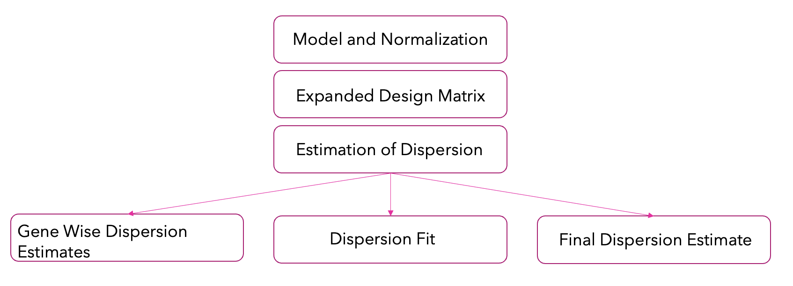

# Differential-Expression-Analysis
The goal of differential expression testing is to determine which genes are expressed at different levels between conditions. These genes can offer biological insight into the processes affected by the condition(s) of interest.

# DESeq2

### How DESeq2 works?
**STEP1 - Size Factor Estimation and Normalization**
1. Read counts are modeled as a Negative Binomial Distribution.
2. Median-of-ratios method is used to estimate the size factors which are crucial for correcting for differences in sequencing depth between samples.
3. Normalization is then performed based on these size factors ensuring the values of genes are comparable across samples.

**STEP2 - Design Matrix Construction**
1. For categorical variables or factors with two or more levels, DESeq2 utilizes expanded design matrices. This includes an indicator variable for each level of each factor, in addition to an intercept column. This allows for a more comprehensive modeling of the data.
2. The purpose of the intercept column in the design matrix could be helpful for understanding its role in the modeling process.

  

**STEP3 - Dispersion Estimation**

In DESeq2, it's assumed that genes of similar average expression strength have similar dispersion. Dispersion estimation is crucial for accurately modeling the variance of gene expression counts across samples.

1. _Gene-wise Dispersion_: Begin by fitting a negative binomial GLM, which provides a rough method-of-moments estimate of dispersion based on within-group variances and means. This accounts for variability in gene expression levels across different conditions.
2. _Dispersion Fit_: Perform a regression fit of gene-wise dispersion estimates.
3. _Final Dispersion Estimate_: Form a logarithmic posterior for the dispersion and use its maximum (MAP value) as the final estimate of the dispersion.

